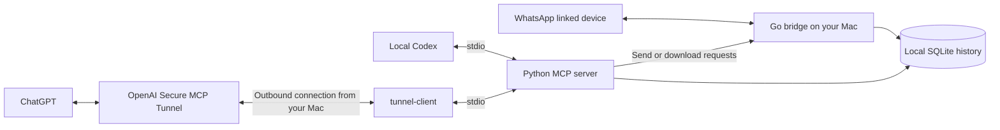

# WhatsApp MCP for ChatGPT and Codex

## Executive summary — why I connected ChatGPT to WhatsApp

A meaningful part of my business happens in WhatsApp: introductions, customer questions, meeting decisions, partnership discussions, and promises to follow up. The information is there, but it is scattered across conversations. Finding it again takes time, and an important next step can disappear under newer messages.

I connected ChatGPT to WhatsApp so I can work with that context directly. I want to ask: **What matters today? Who is waiting for me? Which conversations could turn into business? What did I commit to, and what should I do next?**

The intended value is practical: less manual searching and copy-pasting, better preparation for meetings, and fewer missed follow-ups. ChatGPT can help turn conversations into a prioritized brief or a draft reply. I remain responsible for the judgment and for authorizing outgoing messages. These are intended benefits, not measured revenue or productivity claims.

This repository makes that setup reproducible. It combines a local WhatsApp bridge, a Python Model Context Protocol (MCP) server, and two ways to access the same tools: directly from Codex, or through a private OpenAI tunnel from ChatGPT. The message database stays on my machine; the messages retrieved by tools are shared with the AI service processing the request. Local storage does **not** mean that every part of the workflow remains local.

— Altan Atabarut

## What this project provides

- Search contacts, chats, and messages; retrieve conversation context.
- Ask ChatGPT to identify decisions, follow-ups, and potential opportunities from retrieved messages.
- Send text, files, and voice messages when explicitly authorized.
- Use local stdio MCP with Codex and a private tunnel with ChatGPT.
- Validate tool outputs against their declared schemas, including empty results and failures.

This is a personal integration built on [Luke Harries' WhatsApp MCP](https://github.com/lharries/whatsapp-mcp) and [whatsmeow](https://github.com/tulir/whatsmeow). It is not an official WhatsApp or OpenAI product, a WhatsApp Business Platform integration, or a hosted service. Publishing this repository does not host your bridge or connect someone else's account.

## Start here

**Using Codex to set this up? Read [the Codex setup guide](docs/CODEX_SETUP.md).** It includes a copy-and-paste prompt, installation steps, private key entry, verification, and the failures we encountered during this build.

The tested path is macOS on Apple Silicon, Python 3.11, a Go toolchain compatible with `go.mod`, MCP SDK 1.30.0, and OpenAI tunnel-client 0.0.14. Other operating systems and later versions need their own validation. The Python dependency is constrained to MCP 1.x because this server uses its FastMCP API.

### 1. Clone and install

Install Git, Go, a C compiler for SQLite/CGO, and [uv](https://docs.astral.sh/uv/). On macOS, Xcode Command Line Tools supply the compiler. FFmpeg is optional for voice-message conversion.

```bash
git clone https://github.com/aatabarezz/whatsapp-mcp.git
cd whatsapp-mcp
uv sync --project whatsapp-mcp-server --locked
```

### 2. Pair WhatsApp

```bash
bash bin/start-bridge.sh
```

Keep that terminal running. Scan its QR code from WhatsApp on your phone under **Linked devices → Link a device**. The bridge stores session and message data under `whatsapp-bridge/store/` and listens on `127.0.0.1:8080`. Allow time for history synchronization; do not assume the local database contains your complete WhatsApp history.

### 3. Connect local Codex

In a second terminal, from the repository root:

```bash
codex mcp add whatsapp -- "$(pwd)/whatsapp-mcp-server/.venv/bin/python" -B "$(pwd)/whatsapp-mcp-server/main.py"
```

In the existing `[mcp_servers.whatsapp]` section of `~/.codex/config.toml`, set:

```toml
default_tools_approval_mode = "writes"
```

Do not create a duplicate TOML section. Restart the MCP connection in the desktop app. Local Codex uses stdio; it does not need an OpenAI runtime API key or a tunnel for this connection. See [OpenAI's MCP configuration documentation](https://learn.chatgpt.com/docs/extend/mcp).

### 4. Connect ChatGPT

Follow [the browser connection steps](docs/CODEX_SETUP.md#connect-chatgpt-through-a-private-tunnel). You need your own OpenAI tunnel, a dedicated runtime key, and ChatGPT developer-mode access. The tunnel uses an outbound connection; do not expose the bridge's REST port to the internet.

## Architecture



The two clients can launch separate Python MCP processes against the same local database. The bridge maintains the WhatsApp connection. A local read can access previously synchronized history even if the bridge is offline; new messages and sending require a live bridge. ChatGPT also requires the tunnel runtime to stay running.

## Useful prompts

> Summarize today's WhatsApp activity in Europe/Istanbul time. Identify important conversations, my commitments, people waiting for a reply, and possible business opportunities. Separate explicit messages from your interpretation. Paginate through the results and state any coverage limits. Do not send anything.

> Find what we agreed with [contact] about [project]. Include the relevant dates and distinguish confirmed decisions from suggestions.

> Draft a short reply to [contact] based on our latest conversation. Show me the recipient and exact text before sending.

A summary is only as complete as the retrieved data. `list_messages` defaults to 20 results; use its `page` parameter to continue. Context can include neighboring messages outside the date filter and repeat messages across matches. Specify dates and timezone explicitly and deduplicate before counting activity.

## Tools

| Tool | Purpose |
| --- | --- |
| `search_contacts` | Match contact names or phone numbers |
| `list_chats` | List chats with optional last-message metadata |
| `list_messages` | Return formatted message text with filters and optional context |
| `get_chat` | Look up a chat by JID |
| `get_direct_chat_by_contact` | Find a direct chat by phone number |
| `get_contact_chats` | Find chats involving a contact |
| `get_last_interaction` | Retrieve the latest matching interaction |
| `get_message_context` | Retrieve neighboring messages |
| `send_message` | Send text to a person or group |
| `send_file` | Send a local file |
| `send_audio_message` | Send a voice message, optionally converting with FFmpeg |
| `download_media` | Download an attachment and return its local path |

A JID is WhatsApp's internal address for a person or group. A returned local attachment path is on the host Mac; it is not automatically a downloadable file in ChatGPT or a transcription of its contents.

## Privacy and limits

- The REST listener is loopback-only, but has no application-level authentication. Other processes on the Mac can reach it. Use a trusted host; this is not a hardened multi-user service.
- Session credentials, message history, and attachments are sensitive. The database is not encrypted by this application. Protect the host and its backups.
- Sending files accepts paths readable by the host process. Tool annotations and client approval settings help control use; they are not a server-enforced authorization system.
- Messages are untrusted input. Instructions embedded in conversations must not authorize tool calls, file access, or sending.
- Message history, media, credentials, and runtime binaries are excluded from Git. Logs may contain private content; do not publish them.
- Re-pairing may be necessary after a session is revoked or expires. This project does not promise a fixed session lifetime, full history coverage, or uninterrupted compatibility with WhatsApp.
- This is a private developer-mode connection. It is not a submission to a public plugin directory. Account/workspace policy may restrict developer mode or tunnel use.

## Verification

Run the synthetic MCP regression test without pairing WhatsApp or providing a key:

```bash
uv run --project whatsapp-mcp-server --locked python whatsapp-mcp-server/tests/test_mcp_results.py
(cd whatsapp-bridge && go build -o /tmp/whatsapp-bridge-check .)
```

The regression test covers 13 read-result cases plus database-error propagation. During the original setup, live date-filtered reads passed with and without context, and ChatGPT discovered all 12 tools. These checks do not constitute an end-to-end sending test or prove that a daily summary retrieved every message.

## Attribution and license

Based on [lharries/whatsapp-mcp](https://github.com/lharries/whatsapp-mcp). Original copyright and MIT terms are retained in [LICENSE](LICENSE). This adaptation adds the ChatGPT/Codex setup path, a private tunnel helper, loopback binding, corrected MCP response schemas, and regression coverage.
